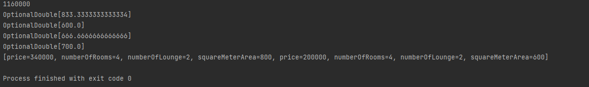

# !!!!PLEASE LOOK AT MASTER BRANCH

# PATIKA SPRING PRACTICUM--House Types App 

# Assignment 1 - House Types Application 

-Create 3 house types: House, Villa, Summer House.

-Create at least 3 House, Villa and Summer House objects in a class and write the methods that return these examples to you. (getEvList, getVillaList etc).

-Also write the following methods inside a service class:

* A method that returns the total prices of houses
* A method that returns the total prices of villas
* The method that returns the total prices of the summer houses
* Method to return the total price of all types of houses
* A method that returns the average square meter of houses
* A method that returns the average square meter of villas
* The method that returns the average square meter of the summer houses
* Method to return the average square meter of houses of all types
* A method that filters all types of houses according to the number of rooms and halls and returns

-Note:

* Make sure the nomenclature is in English.
* Design in accordance with object-oriented programming.
* Follow the clean code principles.
* Print all the methods in the main method to the console in a meaningful way.

# TR 

# 1. Ödev - Ev Tipleri Uygulaması 

-Ev, Villa, Yazlık tipinde 3 adet ev tipi oluşturunuz.

-Bir class içerisinde en az 3er tane Ev, Villa ve Yazlık nesnelerinden oluşturun ve bu örnekleri size dönen metotları yazınız. (getEvList, getVillaList vs).

-Bir servis class'ının içine de aşağıdaki metotları yazınız:

* Evlerin toplam fiyatlarını dönen bir metot
* Villaların toplam fiyatlarını dönen bir metot
* Yazlıkların toplam fiyatlarını dönen metot
* Tüm tipteki evlerin toplam fiyatını dönen metot
* Evlerin ortalama metrekaresini dönen bir metot
* Villaların ortalama metrekaresini dönen bir metot
* Yazlıkların ortalama metrekaresini dönen metot
* Tüm tipteki evlerin ortalama metrekaresini dönen metot
* Oda ve salon sayısına göre tüm tipteki evleri filtreleyip dönen metot

-Not:

* İsimlendirmelerin İngilizce olmasına dikkat ediniz.
* Nesneye yönelik programlamaya uygun tasarım yapınız.
* Clean code prensiplerine uyunuz.
* Main metot içinde tüm metotları konsola anlamlı şekilde yazdırınız.

